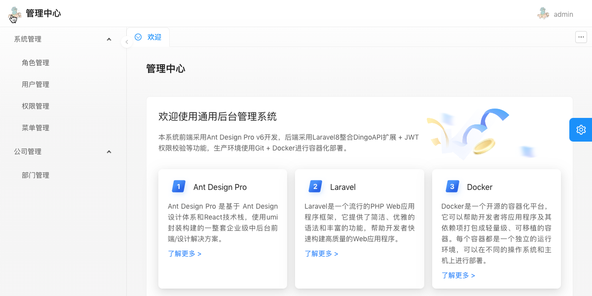

# laravel-antdpro

这是一个基于Laravel+AntdPro开发的后台管理系统模板。

本系统前端采用Ant Design Pro v6开发，后端采用Laravel8.3整合DingoAPI + JWT权限校验+RBAC权限管理，生产环境使用Git + Docker进行容器化部署。

演示站点：https://antdpro.itxiaoma.cn

测试账号：admin@admin.com  密码：123456

